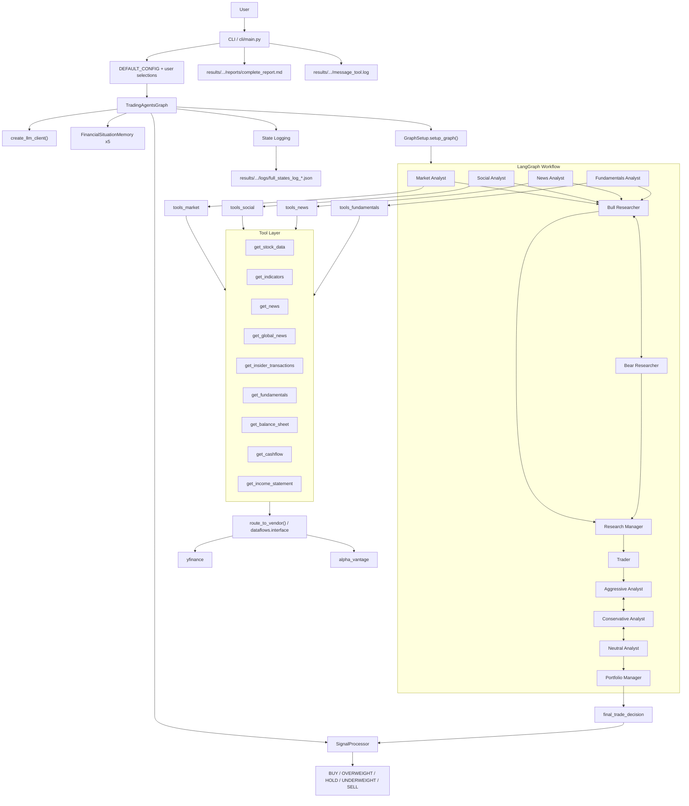
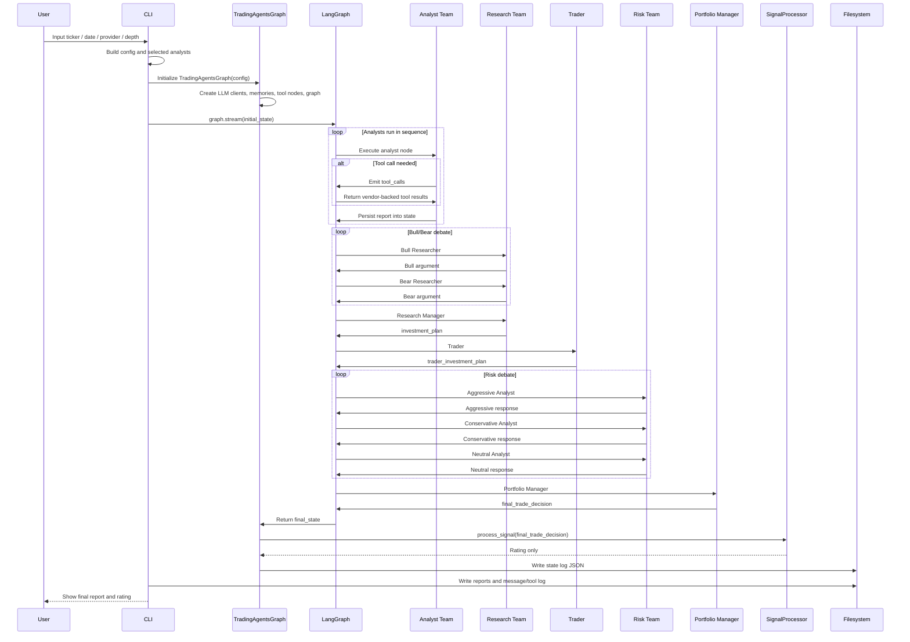

# TradingAgents Architecture

This document gives a fast, code-aligned view of how TradingAgents is wired together.

Core implementation anchors:

- `tradingagents/graph/trading_graph.py`
- `tradingagents/graph/setup.py`
- `tradingagents/dataflows/interface.py`

## System Architecture

## Execution Sequence

